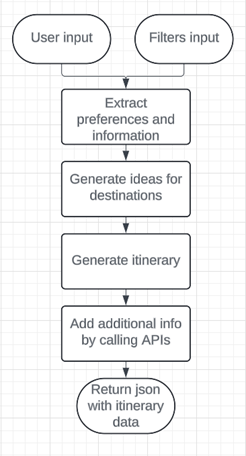

# 🏝️ TripTailor

TripTailor is an **AI-powered travel planning assistant** that creates **personalized itineraries** tailored to your preferences. Simply describe your dream adventure, and TripTailor will generate a detailed plan, complete with recommended destinations, travel times, opening hours, and even lunch breaks — so you can focus on enjoying your trip!


## 🎥 Demonstration


Here’s how TripTailor works:  
1. The user provides a text prompt describing their ideal trip (with as much or as little detail as they want).  
2. They can also apply filters for budget, travel dates, and other preferences.  
3. This information is processed by the AI pipeline, which:  
   - Identifies user preferences.  
   - Brainstorms destination ideas.  
   - Fetches relevant data from Google Maps.  
   - Generates a final, polished itinerary.  


## 📋 Table of Contents

- [🏝️ TripTailor](#️-triptailor)
  - [🎥 Demonstration](#-demonstration)
  - [📋 Table of Contents](#-table-of-contents)
  - [⭐ Features](#-features)
  - [🛠️ Tech Stack \& APIs](#️-tech-stack--apis)
  - [🤖 AI Agent Architecture](#-ai-agent-architecture)
  - [📁 Project Structure](#-project-structure)
  - [🚀 Run Locally](#-run-locally)
    - [Prerequisites](#prerequisites)
    - [Option 1: Using Poetry](#option-1-using-poetry)
    - [Option 2: Using `requirements.txt`](#option-2-using-requirementstxt)
  - [🛤️ Roadmap](#️-roadmap)
  - [⚖️ License](#️-license)
  - [🔗 Links](#-links)


## ⭐ Features

- **Personalized Travel Itineraries**: Generates customized plans based on budget, travel dates, and preferences.  
- **Real-Time Data Integration**: Fetches live information from APIs like Google Places.  
- **In-Depth Analysis**: Considers distances and travel times to optimize your itinerary.  
- **Itinerary PDF**: Download a PDF version of your personalized itinerary.  


## 🛠️ Tech Stack & APIs

- **AI Pipeline**: LangChain, OpenAI API (to be replaced with open-source), Google Places API  
- **Backend**: Python, Flask, Redis (session data storage)  
- **Frontend**: HTML, CSS, JavaScript, Bootstrap, Leaflet (map integration)
- **Deployment**: Docker, Heroku  


## 🤖 AI Agent Architecture



The AI pipeline follows these steps:  
1. **Extract Preferences**: Analyze the user’s input to identify travel preferences.  
2. **Generate Destination Ideas**: Brainstorm potential destinations based on the extracted preferences.  
3. **Create Itinerary**: Design a detailed travel plan, including activities and timings.  
4. **Populate with Data**: Enhance the itinerary with links, photos, and real-time data from Google Places API.  


## 📁 Project Structure

```
├── LICENSE            <- Open-source license if one is chosen
├── Makefile           <- Makefile with convenience commands like `make data` or `make train`
├── README.md          <- The top-level README for developers using this project.
├── data
│   ├── external       <- Data from third party sources.
│   ├── interim        <- Intermediate data that has been transformed.
│   ├── processed      <- The final, canonical data sets for modeling.
│   └── raw            <- The original, immutable data dump.
│
├── docs               <- A default mkdocs project; see www.mkdocs.org for details
│
├── models             <- Trained and serialized models, model predictions, or model summaries
│
├── notebooks          <- Jupyter notebooks for initial experiments
│
├── pyproject.toml     <- Project configuration file with package metadata for 
│                         triptailor and configuration for tools like black
│
├── references         <- Data dictionaries, manuals, and all other explanatory materials.
│
├── reports            <- Generated analysis as HTML, PDF, LaTeX, etc.
│   └── figures        <- Generated graphics and figures to be used in reporting
│
├── requirements.txt   <- The requirements file for reproducing the analysis environment, e.g.
│                         generated with `pip freeze > requirements.txt`
│
├── setup.cfg          <- Configuration file for flake8
│
├── Procfile           <- File defining how to start the app for Heroku
│
└── triptailor   <- Source code for use in this project.
    │
    ├── __init__.py             <- Makes triptailor a Python module
    │
    ├── etc/defaults.cfg        <- Store useful variables and configuration
    │
    ├── logger.py               <- Initialized logger
    │
    ├── main.py                 <- Starts up the application
    |
    ├── routes.py               <- Defines API routes
    |
    ├── templates/              <- HTML templates for Flask to render  
    |
    ├── modeling                
    │   ├── __init__.py 
    │   ├── agent.py            <- Class defining the pipeline of LLM calls         
    │   ├── data_schemas.py     <- Contains desired output format for the LLM calls          
    │   ├── inference.py        <- Class running a pipeline to generate itinerary          
    │   ├── prompts.py          <- Contains prompt templates used to form an LLM request          
    │   └── itinerary_example.json <- Sample itinerary used when debugging
    │
    └── static/                 <- CSS and JS files for the frontend
```


## 🚀 Run Locally

### Prerequisites
- **Python 3.12.0**
- **Redis Server** (for caching)

Create `.env` file and add the relevant API keys and your Redis server url. Use `env_example.txt` as a template for your env file.

### Option 1: Using Poetry
1. Install Poetry if not already installed:
   ```bash
   pip install poetry
   ```

2. Install dependencies:
   ```bash
   poetry install
   ```

3. Start the application:
   ```bash
   poetry run python -m triptailor.main
   ```

---

### Option 2: Using `requirements.txt`
If Poetry is not available, use `pip` to install dependencies.

1. Install dependencies:
   ```bash
   pip install -r requirements.txt
   ```

2. Start the application:
   ```bash
   python -m triptailor.main
   ```


## 🛤️ Roadmap  

- **Itinerary Redaction Tool**: Allow users to modify specific parts of the itinerary with a new text prompt. For example, "Replace the museum visit on Day 3 with a beach day."  
- **Overall Estimated Cost**: Provide a detailed breakdown of estimated trip expenses, including accommodation, transportation, and activities.  
- **General Info**: Include useful details like currency exchange rates, time zones, common languages, and outlet types.  
- **Currency Selection**: Allow users to input their budget in their preferred currency, not just EUR.  
- **Event Integration**: Use APIs like Eventbrite to display local events during the user’s stay, with options to add them to the itinerary.  
- **Open-Source LLM**: Transition from OpenAI API to a local, open-source LLM for greater independence and cost efficiency.  

---

## ⚖️ License  
This project is licensed under the **MIT License**.  

## 🔗 Links  
- **Repository**: [GitHub](https://github.com/Logisx/TripTailor)
- **Connect**: [My LinkedIn](https://www.linkedin.com/in/aleksandrshishkov/)  


--------

